# Raw }> WebAuthn example

Various [WebAuthn/passkey](https://developer.mozilla.org/en-US/docs/Web/API/Web_Authentication_API) related questions have been trending in Vaadin community. And by no surprise. In 2024 "passkeys" should be the only acceptable authentication method for any self-respecting software craftsman and passwords should be burnt with 🔥.

Some questions have been rather low level, essentially how to work with the low level browser API from Vaadin web apps. For those asking that, I'd rhetorically ask, are you developing the right thing? For most/many Vaadin apps, it would be better to utilize WebAuthn indirectly. For example, if you use identity management server/SSO, like [KeyCloak](https://www.keycloak.org), you should probably just configure that to enable passkeys instead. Or alternatively consider utilizing it through something like [Spring Security](https://github.com/webauthn4j/webauthn4j-spring-security).

Sometimes there can be reasons to build the integration yourself. Usually the reasons are wrong, but learning and understanding the concepts  is a very good one. As the instructions for low level utilization of the WebAuthn browser API was recently asked and the use case also provides a generic example to consume modern Promise based JavaScript APIs from Vaadin, I decided to build an example out of atoms to implement _basic authentication & authorization with WebAuthn_, with minimal additional dependencies.

*Disclaimer: In case you really need to implement WebAuthn from atoms like this in your real world app, I highly suggest learn and fully understand "the math" behind passkey authentication. Start for example with [this entertaining and informative JFokus 2023 presentation](https://www.youtube.com/watch?v=zKNbNWr-an0) I happened to be following live myself last week.*

Enough warnings, let's skim the most relevant parts in this example project:

To handle the public-key cryptography I dropped in the `com.yubico:webauthn-server-core` dependency from Yubico. The app itself uses Spring Boot, but mostly just to start Tomcat, for example Spring Security is not use, so that you can understand what actually happens behind the scenes. A bit of "dependency injection magic" is used for some classes, but getting rid of that ought to be fairly simple if you are allergic to it 🤪

The codebase contains a lot of comments for non-trivial parts, so it should work as learning material as such. But check out at least these parts and the sequence diagram below:

The [WebAuthnSession](https://github.com/mstahv/raw-webauthn-example/blob/main/src/main/java/org/example/WebAuthnSession.java) abstracts the WebAuthn details for the UI and maintains session. It delegates the registration and validation requests initiated by `WebAuthnService` by to the browser API and returns the credentials back to it. It is naturally used in the [LoginAndRegistrationView](https://github.com/mstahv/raw-webauthn-example/blob/main/src/main/java/org/example/views/LoginAndRegistrationView.java) also used by the [AccessControlChecker](https://github.com/mstahv/raw-webauthn-example/blob/main/src/main/java/org/example/AccessControlChecker.java), which is trivial implementation: there are no roles, but only admitting logged-in users to the actual app view(s).

A part of WebAuthnSession that might interest Vaadin developers who don't care about WebAuthn itself, is how we call the asynchronous browser(JavaScript) API from the server side Java code. For example here:

https://github.com/mstahv/raw-webauthn-example/blob/fea74226ac61ce63906d4d1eba6242a77c91d4e7/src/main/java/org/example/WebAuthnSession.java#L175-L189

We use the `await` syntax in the script body. This essentially make the rest of the script body to be a Promise and the final, 'resolved' value of the script is returned to the server asynchronously as a CompletableFuture. In this case there is a user interaction happening between (and most likely for example fingerprint scanning) before the finishAssertion method is called. Currently, the await keyword needs Viritin add-on, but [a PR was recently merged](https://github.com/vaadin/flow/pull/18698) to land similar feature to the core.

With the help of CompletableFuture and `Promise`s/`async` keyword on the JS side, the final API used in the UI code becomes clean and maintainable, event though it contains asynchronous logic spread over to both client and the server. Here is what happens e.g. when clicking the register button:

https://github.com/mstahv/raw-webauthn-example/blob/main/src/main/java/org/example/views/LoginAndRegistrationView.java#L56-L66

The server side configuration and `com.yubico:webauthn-server-core` usage is in [WebAuthnService](https://github.com/mstahv/raw-webauthn-example/blob/main/src/main/java/org/example/WebAuthnService.java). I built it pretty much by copy-pasting from Yubico's documentation. The Yubico's API needs a CredentialsRepository implementation, which I quickly hacked together as an [in-memory implementation](https://github.com/mstahv/raw-webauthn-example/blob/main/src/main/java/org/example/InMemoryRegistrationRepository.java). That interface may first appear overly complex, but that is due to (mostly valid) assumption that a user account might have multiple passkeys and/or other authentication mechanisms. In a real world app, this part probably needs most thinking: how to store the public keys into your existing user database. The nice part is that, as opposed to storing passwords in databased, it is much harder to disastrously fail storing passkeys in a wrong way.

A simplified Sequence Diagram describing what happens during a registration process, below. The parts that utilize public-key cryptography marked with 🔐. 

```mermaid
sequenceDiagram
    actor B as Browser/User
    box ☕<br> Server
        participant V as UI logic
        participant C as WebAuthnSession
        participant S as WebAuthnService
    end


    B->>+V: Open the app
    V->>+C: Is the user logged in?
    C-->>V: Nope
    V-->>B: Login or create an account?
    B-)V: I'd like to register as "Mary"
    V->>+C: Start registratin for "Mary"
    C->>S: "Mary" would like to register
    S-->>C: "Mary" is free, request passkey<br/>with these settings & claim 🔐
    C->>+B: Registration parameters for the WebAuthn JS API 🔐
    B->>B: WebAuthn API asks permission<br> to create new key and authenticates<br> with e.g. fingerprint or facial recocgnition.
    B-->>-C: Here is the new passkey, with your claim 🔐 
    C->>S: Validate response and<br> save passkey for "Mary" 🔐
    S-->>C: All good!
    C-->>-V: "Mary" registered and logged in
    V-->>V: Display main view
    V--)B: Now you can access the actaul view...
    loop Do the actual work
        B--)V: Fill data
        V--)B: Receive updates
    end
    B--)V: Close the Window
    V-->-V: cleanup
    C-->-V: 

```

In case of a login, we are doing pretty similar sequence. The login process also starts from the server/service by creation of a claim. But now we don't need to specify the username, but let the user provide the passkey. In the login we again validate the claim and the service looks for an account (~ unique username in this app) that is associated to the given passkey.

A lot of Vaadin apps are in areas of "very business critical", like banks transferring millions dollars or in military/medical area where unauthorized access can be lethal. Thus, I wanted to also drop in [an additional example for re-authentication, before executing a very critical action](https://github.com/mstahv/raw-webauthn-example/blob/main/src/main/java/org/example/views/ImportantTaskDialog.java). Practically we require a new fingerprint or facial recognition, before letting the critical action go through. Just to make sure that nobody forgot their laptop lid open during a coffee break... The flow in that kind of case is pretty much the same as in login, but this time we request the passkey to be exactly the same as was used earlier in the login.

## Useful links

- Read the documentation at [vaadin.com/docs](https://vaadin.com/docs).
- Follow the tutorials at [vaadin.com/tutorials](https://vaadin.com/tutorials).
- Watch training videos and get certified at [vaadin.com/learn/training]( https://vaadin.com/learn/training).
- Create new projects at [start.vaadin.com](https://start.vaadin.com/).
- Search UI components and their usage examples at [vaadin.com/components](https://vaadin.com/components).
- Find a collection of solutions to common use cases in [Vaadin Cookbook](https://cookbook.vaadin.com/).
- Find Add-ons at [vaadin.com/directory](https://vaadin.com/directory).
- Ask questions on [Stack Overflow](https://stackoverflow.com/questions/tagged/vaadin) or join our [Discord channel](https://discord.gg/MYFq5RTbBn).
- Report issues, create pull requests in [GitHub](https://github.com/vaadin/).
